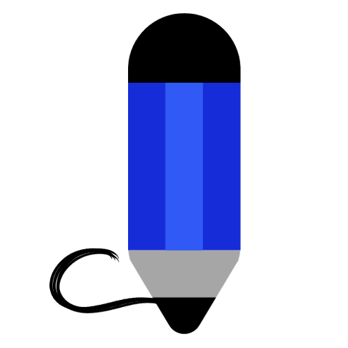

<!-- .-->

<div align="center">
</br>


</div>

<h1 align="center">Taaveez</h1>

<h4 align="center">✍️ Say Hello to Taaveez, the cool new app made just for artists and entertainers. It's super easy to use! You can write down your ideas and cool stuff with just a few taps.    
This project showcases the Good implementation of Android with proper architecture design with Modern Android development tools.      
Made with ♥ for all Android Developers
<br>
<br>
I’m building it in public. So the idea is for everyone to contribute, leave comments, suggest ideas, etc. using the <a href="https://github.com/Suryansh1720001/Taaveez/discussions">Discussions</a> tab.
<br>
<br>
Please go through the <a href="https://github.com/Suryansh1720001/Taaveez/blob/master/CONTRIBUTING.md">CONTRIBUTING.md</a> file before you start contributing.
</h4>


<div align="center">
</br>


</div>


<div align="center">
  
# ⬇️ Download
<a href="https://play.google.com/store/apps/details?id=com.itssuryansh.taaveez">
<a href="https://github.com/Suryansh1720001/Taaveez/releases/latest">
</div>


# Features ✨
Unleash your artistic expression with Taaveez, the perfect app for creatives. Say goodbye to disorganization, easily save, update, and share your work with a few taps.Track your journey and refine your work anytime, anywhere. Download now and unleash your creative potential! You can save all your stuff in one app.

_Taaveez_ focuses on the following key things:

- Simple Activity Design.
- Offline Capability - Content.
- Clean and Simple Material UI. 🎨
- Dark mode. 🌗
- Material UI. 🖌
- Switch between layouts. 🌟
- Share the content easily. 📤
- Multilingual support. 


<!--
The foundation of this platform lies in the Kotlin language, empowering content creators to express their thoughts and ideas in an array of genres. 
- From the eloquent beauty of **poems or कविताएं**, 
- to the captivating narratives of **stories or कहानियां**, 
- and even the profound wisdom of **couplets or दोहे**,
- the possibilities for creativity are endless.
-->


# Built with 🛠

- [Kotlin](https://kotlinlang.org/) - First class and official programming language for Android development.
- [Coroutines](https://kotlinlang.org/docs/reference/coroutines-overview.html) - For asynchronous calls and tasks to utilize threads.
- [Android Architecture Components](https://developer.android.com/topic/libraries/architecture) - Collection of libraries that help you design robust, testable, and maintainable apps.
  - [LiveData](https://developer.android.com/topic/libraries/architecture/livedata) - Data objects that notify views when the underlying database changes.
  - [ViewModel](https://developer.android.com/topic/libraries/architecture/viewmodel) - Stores UI-related data that isn't destroyed on UI changes.
  - [Room](https://developer.android.com/topic/libraries/architecture/room) - Room is an Android library which is an ORM that wraps Android's native SQLite database.
  - [StateFlow and SharedFlow](https://developer.android.com/kotlin/flow/stateflow-and-sharedflow#:~:text=StateFlow%20is%20a%20state%2Dholder,property%20of%20the%20MutableStateFlow%20class.) - StateFlow and SharedFlow are Flow APIs that enable flows to optimally emit state updates and emit values to multiple consumers.
<!--
- [Dependency Injection](https://developer.android.com/training/dependency-injection) -
    - [Hilt-Dagger](https://dagger.dev/hilt/) - A standard way to incorporate Dagger dependency injection into an Android application.
    - [Hilt-ViewModel](https://developer.android.com/training/dependency-injection/hilt-jetpack) - DI for injecting ```ViewModel```. 
    -->
- [Material Components for Android](https://github.com/material-components/material-components-android) - Modular and customizable Material Design UI components for Android.
- [Accompanist](https://google.github.io/accompanist/) - A collection of extension libraries for Jetpack Compose.
<!--
- [Biometric](https://developer.android.com/jetpack/androidx/releases/biometric) - Authenticate with biometrics or device credentials, and perform cryptographic operations.
--->

# Architecture 👷‍♂️
This app uses [MVVM(Model View View-Model)](https://developer.android.com/topic/architecture#recommended-app-arch) architecture.


## 🔏 Privacy Policy

- Click here for - [Privacy Policy](https://taaveez.vercel.app/privacy-policy/taaveez-privacy-policy.html)


## <h1 align=center>Screenshots 📸</h1>


||||
|:----------------------------------------:|:-----------------------------------------:|:-----------------------------------------:|
|  |  |  |
|  |  |  |
|  | |   |


<!--
## 🖥️ Technology

Under the umbrella of "Technology" lies a powerful combination of

- Kotlin language
- xml language
- Android Studio
- Room database

⭐ And naturally, the Taaveez App is available for all to explore, with its open-source code hosted on a [Public Repository](https://github.com/Suryansh1720001/Taaveez).
-->


# <h1 align=center>⭐ OPEN-SOURCE CONTRIBUTION ⭐</h1>

<h1 align=center> Project Admin  🤵 </h1>

  <p align="center">
  <a href="https://github.com/suryansh1720001"></a>

 
<!--   <a target="_blank" href="https://www.linkedin.com/in/itssuryansh/"></a>&nbsp;&nbsp;&nbsp;&nbsp;
       <a href="https://twitter.com/itssuryanshP"></a>
<!--   <a href="itssuryanshprajapati@gmail.com"></a>&nbsp;&nbsp;&nbsp;&nbsp; -->
<!--   <a href="https://www.instagram.com/_its_s.u.r.y.a.n.s.h/"></a>&nbsp;&nbsp;&nbsp;&nbsp; --> 
 <div align="center">
        <a href="https://www.linkedin.com/in/itssuryansh/"></a>
        <a href="mailto:itssuryanshprajapati@gmail.com"></a>
       <a href="https://medium.com/@itssuryansh"></a>
        <a href="https://twitter.com/itssuryanshP"></a>
        <a href="https://github.com/Suryansh1720001"></a>
        <a href="https://www.instagram.com/_its_s.u.r.y.a.n.s.h?r=nametag"></a>
    
    
 </div>
 
   
</p>

<!--
# 🖱️ How to Contribute 

If you think that you can add a new feature or want to fix a bug, we invite you to contribute to Taaveez and make this project better. To start contributing, follow the below instructions:

1. Create a folder at your desire location (usually at your desktop).

2. Open Git Bash Here

3. Create a Git repository.

   Run the command `git init`

4. [Fork](https://github.com/Suryansh1720001/Taaveez) the project. Click on the <a href="https://github.com/Suryansh1720001/Taaveez/fork"></a> icon in the top right to get started.

5. Clone your forked repository of the project.

```bash
git clone https://github.com/<your_username>/Taaveez.git
```

6. Navigate to the project directory.

```bash
cd Taaveez
```

7. Add a reference(remote) to the original repository.

```bash
git remote add upstream https://github.com/Suryansh1720001/Taaveez.git
```

8. Check the remotes for this repository.

```bash
git remote -v
```

9. Always take a pull from the upstream repository to your main branch to keep it updated as per the main project repository.

```bash
git pull upstream main
```

10. Create a new branch(prefer a branch name that relates to your assigned issue).

```bash
git checkout -b <YOUR_BRANCH_NAME>
```

11. Perform your desired changes to the code base.

12. Check your changes.

```bash
git status
```

```bash
git  diff
```

13. Stage your changes.

```bash
git add . <\files_that_you_made_changes>
```

14. Commit your changes.

```bash
git commit -m "Commit Message"
```

15. Push the committed changes in your feature branch to your remote repository.

```bash
git push -u origin <your_branch_name>
```

16. To create a pull request, click on `compare and pull requests`.

17. Add an appropriate title and description to your PR explaining your changes.

18. Click on `Create pull request`.

Congratulations🎉, you have made a PR to the Calculator.
Wait for your submission to be accepted and your PR to be merged by a maintainer.


-->

## 🫴 How to Do Your First Pull Request?  
   ***(I am providing some Resource from where you can Learn)***

1. [Learn from Video](https://www.youtube.com/watch?v=nkuYH40cjo4)
2. [Open Source Guide](https://opensource.guide/how-to-contribute/)

## 👩🏽‍💻 Contributing

- Contributions make the open-source community such an amazing place to learn, inspire, and create.
- Any contributions you make are greatly appreciated.
- Check out our [contribution guidelines](/CONTRIBUTING.md) for more information.


## Want to contribute?
- Take a look at [`contributing guidelines`](CONTRIBUTING.md).
- Refer [GitHub Flow](https://guides.github.com/introduction/flow).

<!--
## License<a name = "license"></a>

```
Copyright © 2023 Suryansh Prajapati

Taaveez is a free software licensed under GPL v3.0
It is distributed in the hope that it will be useful, but WITHOUT ANY WARRANTY;
without even the implied warranty of MERCHANTABILITY or FITNESS FOR A PARTICULAR PURPOSE.
```

```
Being Open Source doesn't mean you can just make a copy of the app and upload it on play store or sell
a closed-source copy of the same.
Read the following carefully:
1. Any copy of software under GPL must be under the same license. So you can't upload the app on a closed-source
  app repository like PlayStore/AppStore without distributing the source code.
2. You can't sell any copied/modified version of the app under any "non-free" license.
   You must provide a copy with the original software or with instructions on how to obtain the original software,
   should clearly state all changes, should disclose full source code, should include the same license
   and all copyrights should be retained.

In simple words, You can ONLY use the source code of this app for `Open Source` Project under `GPL v3.0` or later
with all your source code DISCLOSED on any code hosting platform like GitHub, with clear INSTRUCTIONS on
how to obtain the original software, should clearly STATE ALL CHANGES made and should RETAIN all copyrights.
Use of this software under any "non-free" license is NOT permitted.
```
--->

See the [Public License](https://github.com/Taaveez/Taaveez-android/blob/master/LICENSE) for more details.

## Code of Conduct

- [Code of Conduct](CODE_OF_CONDUCT.md)


## 🙏🏽 Support

This project needs a star️ from you. Don't forget to leave a star✨
Follow my Github for content
<br>
<br>
<hr>
<h6 align="center">© Suryansh Prajapati 2023
<br>
All Rights Reserved</h6>


